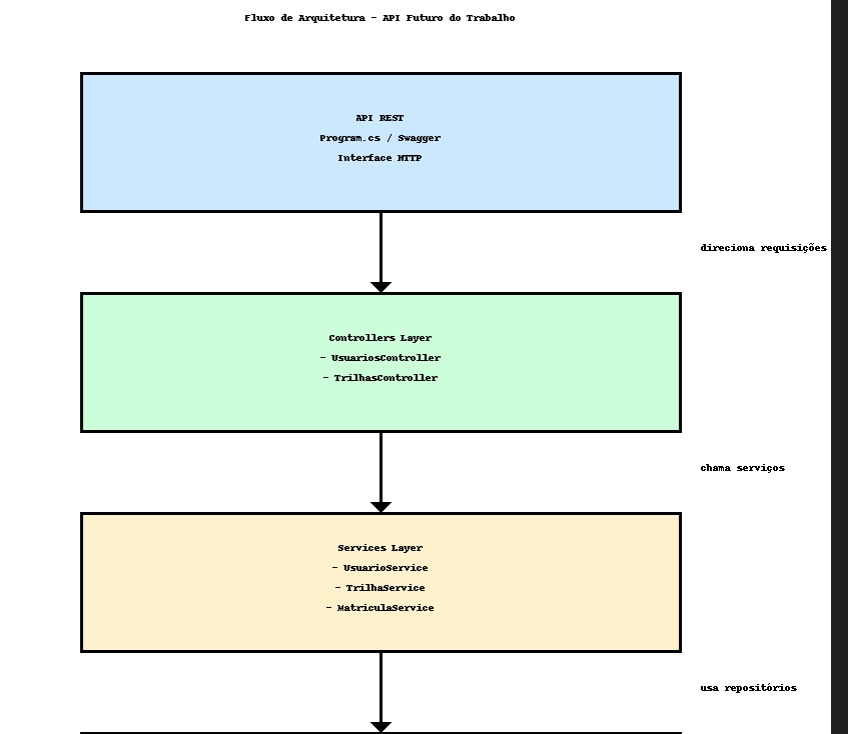
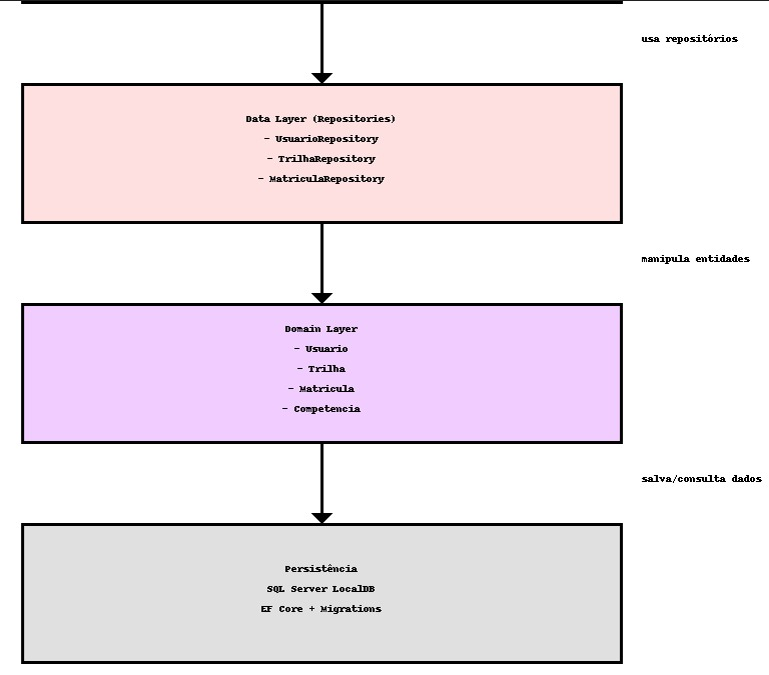

# 🧠 Futuro do Trabalho — Plataforma de Upskilling e Reskilling (API)

**Linguagem:** C# 10.0  
**Framework:** .NET 8  
**IDE:** **Visual Studio 2026**  
> ⚠ **IMPORTANTE:** Esta API **não roda** em versões anteriores do Visual Studio.  
> É necessário estar no **Visual Studio 2026** (ou superior) para suporte total ao C# 10.0.

**Banco de Dados:** SQL Server LocalDB  
**ORM:** Entity Framework Core  
**Arquitetura:** SOA — Service Oriented Architecture  
**Padrão:** REST  
**Tema:** Upskilling & Reskilling – Futuro do Trabalho 2030+

---

# 🎯 Sobre o Projeto

Esta API foi construída como parte da disciplina de **Arquitetura Orientada a Serviços (SOA)**, atendendo ao desafio da Global Solution 2025 da FIAP.

A solução implementa:

- Cadastro de usuários  
- Cadastro de trilhas de aprendizagem  
- Matrícula entre usuários ↔ trilhas  
- Consulta de trilhas por usuário  
- Consulta de usuários por trilha  
- Seeds automáticos  
- Banco criado automaticamente via Migrate()

---

# 🧱 Arquitetura da Aplicação



```
Controllers  →  Services  →  Repositories  →  ApplicationDbContext  →  SQL Server
```

✔ Separação de responsabilidades  
✔ Clean Architecture para facilitar manutenção  
✔ Camada Service contendo toda regra de negócio  
✔ Camada Repository para abstração de acesso ao banco  

---

# 🗂 Tecnologias Utilizadas

| Camada | Tecnologia |
|-------|------------|
| Linguagem | C# 10.0 |
| Framework | .NET 8 |
| IDE | Visual Studio 2026 |
| Banco de Dados | SQL Server LocalDB |
| ORM | Entity Framework Core |
| Documentação | Swagger/OpenAPI |
| Arquitetura | SOA |
| Padrão | REST |

---

# 🚀 Funcionalidades

## Usuários
- Criar usuário  
- Listar todos  
- Buscar por ID  
- Atualizar  
- Deletar  

## Trilhas
- Criar trilha  
- Listar trilhas  
- Buscar por ID  
- Atualizar  
- Deletar  

## Matrículas
- Matricular usuário em trilha  
- Ver trilhas de um usuário  
- Ver usuários de uma trilha  
- Remover matrícula  

---

# 🧪 Seeds Automáticos

A API popula automaticamente os seguintes dados:

### Competências do Futuro
- Inteligência Artificial  
- Análise de Dados  
- Soft Skills  

### Trilhas Preparadas
- IA para Negócios  
- Dados para Tomada de Decisão  

---

# 🔌 Como Rodar o Projeto

## 1. Pré-requisitos
- Visual Studio **2026**  
- SQL Server LocalDB  
- .NET 8 SDK  

⚠ **Sem Visual Studio 2026 o projeto não compila.**

---

## 2. Clonar o projeto
```
https://github.com/Torugo0/FuturoDoTrabalho.Api.git
```

## 3. Abrir a pasta do projeto no Visual Studio
```
Na pasta do projeto, clicar duas vezes em FuturoDoTrabalho.Api.slnx
```

## 4. Executar o projeto
```
Com a solução aberta, clicar no icone verde com https ao lado para rodar a API
```

---

# 📚 Endpoints Principais

## Usuários
| Verbo | Endpoint |
|-------|----------|
| POST | /api/v1/usuarios |
| GET | /api/v1/usuarios |
| GET | /api/v1/usuarios/{id} |
| PUT | /api/v1/usuarios/{id} |
| DELETE | /api/v1/usuarios/{id} |

## Trilhas
| Verbo | Endpoint |
|-------|----------|
| POST | /api/v1/trilhas |
| GET | /api/v1/trilhas |
| GET | /api/v1/trilhas/{id} |
| PUT | /api/v1/trilhas/{id} |
| DELETE | /api/v1/trilhas/{id} |

## Matrículas
| Verbo | Endpoint |
|-------|----------|
| POST | /api/v1/usuarios/{usuarioId}/trilhas/{trilhaId} |
| DELETE | /api/v1/usuarios/{usuarioId}/trilhas/{trilhaId} |
| GET | /api/v1/usuarios/{usuarioId}/trilhas |
| GET | /api/v1/trilhas/{trilhaId}/usuarios |

---

# 👥 Integrantes
Gabriel Machado Carrara Pimentel — RM99880 · Lourenzo Ramos — RM99951 · Vitor Hugo Rodrigues — RM97758.

---
